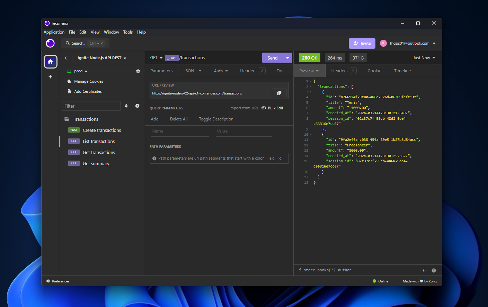

# API REST Node.js

Neste módulo da formação em Node da [Rocketseat](https://www.rocketseat.com.br) desenvolvemos uma API REST utilizando tecnologias como Fastify, Knex, TypeScript, SQL e outras ferramentas para auxiliar durante o desenvolvimento. Durante o curso, abordamos uma variedade de conceitos importantes que são aplicados no cotidiano dos desenvolvedores.

# RF

- [x] O usuário deve poder criar uma nova transação;
- [x] O usuário deve poder obter um resumo da sua conta;
- [x] O usuário deve poder listar todas transações que já ocorreram;
- [x] O usuário deve poder visualizar uma transação única;

# RN

- [x] A transação pode ser do tipo crédito que somará ao valor total, ou débito subtrairá;
- [ ] Deve ser possível identificarmos o usuário entre as requisições;
- [ ] O usuário só pode visualizar transações o qual ele criou;